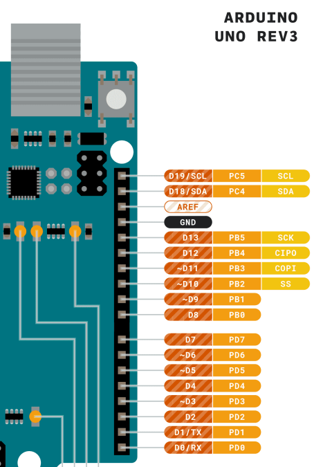

# Workshop Basic Arduino UKM Robotik Sikonek

Pada workshop kali kita akan belajar mengenai basic dari arduino, mulai dari:
- Hardware
- Software dan basic programming
- Cara menggunakan sensor (sensor jarak HC-SR04 ultrasonic sensor)
- Cara mengendalikan motor (motor servo)

## Introduction Arduino dan Basic Programming

### Overview Singkat Arduino dan Kemampuannya
- Arduino adalah platform elektronik Open-Source untuk hardware dan software yang mudah digunakan dan biasa digunakan untuk pembelajaran mikrokontroller dan embedded system karena simpel dan serbaguna
Terdiri Dari Programmable Circuit Board (Mikrokontroller) dan development environtment untuk menulis code dan mengupload code ke Board.

- **Kemampuannya**
dapat berinterface dengan banyak jenis sensor, display, dan comunnication modules. sehingga sering digunakan untuk robotik, IoT (home automation), dll.
Pemrogramman yang flexibel, terdapat banyak library dan mudah untuk mengontrol motor, komunikasi dengan perangkat lain, dan dapat mengimplementasikan algoritma kompleks. Komunitas yang besar dan aktif, sehingga mudah mencari bantuan, inspirasi untuk project.

### Pinout Arduino Uno


1. **Pinout power:**
   
- **Power Jack**
sebagai adapter power supply 7-12V
- **Vin**
pin untuk external power source
- **USB jack**
konek ke komputer, menyediakan 5v 500mA
- **5V dan 3v3**
menyediakan 5v dan 3,3V untuk memberi daya komponen external
- **GND**
pin GND digunakan untuk menutup rangkaian listrik

2. **Pinout Analog**
   
 - Dapat digunakan sebagai input dan output
 - Arduino Uno punya 6 analog pin, sebagai **ADC**(Analog to Digital Converter).
berfungsi untuk mengubah signal analog menjadi signal digital, agar dapat dihitung oleh prosesornya untuk dapat digunakan untuk operasi.
 - Pada arduino ADC itu 10-bit. artinya merepresentasikan voltage analog menjadi 1024(2^10) dalam level digital
 - Pin analog bisa digunakan untuk membaca data sensor analog seperti sensor suhu, sensor cahaya, pontensiometer, dll.

3. **Pinout Digital**
   
- Pin digital dapat digunakan sebagai input dan output (pin 0 - 13)
- **Sebagai INPUT** membaca signal digital HIGH = 5V dan LOW = 0V
- **Sebagai OUTPUT** memberikan signal digital HIGH dan LOW untuk mengontrol LED, relay, motor, dan digital device lainnya
- pin PWM (~), digunakan untuk men-generate sinyal seperti analog dengan menggunakan sinyal. pin PWM pada Uno itu 8-bit (2^8 = 256). artinya menghasilak sinyal PWM 0 sampai 255. biasa digunakan untuk mengontrol kecepatan motor, kecerahan LED, dll

## Basic Konsep Pemrogramman Arduino C

### Structure
```c
#include <Servo.h>
#include <LiquidCrystal.h>
#include "CMPS12.h"

#define LED_BUILTIN 13

int loop_count = 0;

void setup(){
     //inisialisasi serial komunikasi
     Serial.begin(9600);

     //set pin mode
     pinMode(LED_BUILTIN, OUTPUT);
     
}

void loop(){
     //blink LED
     digitalWrite(LED_BUILTIN, HIGH);
     delay(1000);
     digitalWrite(LED_BUILTIN, LOW);
     delay(1000);
}
```

1. **setup()**
```c
void setup(){
     //inisialisasi serial komunikasi
     Serial.begin(9600);

     //set pin mode
     pinMode(LED_BUILTIN, OUTPUT);
     
}
```
- dijalankan hanya sekali saat Arduino board diberikan daya atau saat reset button ditekan
- untuk inisialisasi variable
- setting pin mode
- menjalankan "one-time setup" yang lainnya

2. **loop()**
```c
void loop(){
     //blink LED
     digitalWrite(LED_BUILTIN, HIGH);
     delay(1000);
     digitalWrite(LED_BUILTIN, LOW);
     delay(1000);
}
```
- dijalankan secara kontiniu setelah setup().
- berisi code utama yang berjalan secara berulang selama arduino masih dalam keadaan hidup
3. **bagian Opsional**
- Inklusi library
```c
#include <Servo.h>
#include <LiquidCrystal.h>
#include "CMPS12.h"
```

- Constant definition
```c
#define LED_BUILTIN 13
```

- Global variable declaration
```c
int loop_count = 0;
```

## Cara menggunakan sensor (sensor jarak HC-SR04 ultrasonic sensor)
Sensor Ultrasonic HC-SR04 adalah sensor jarak. Menggunakan prinsip kecepatan suara. **Akurasi** dari sensor ini adalah **2-400cm**

### Wiring HC-SR04 ke Arduino


### Wiring HC-SR04 menggunakan breadboard


- Vcc -> 5V
- GND -> GND
- Trig -> 2
- Echo -> 3

[click disini untuk melihat code](https://github.com/MikaelKevintanNaibaho/workshop_sikonek/blob/main/baca_hcsr/baca_hcsr.ino)

## Cara mengendalikan motor servo
- Motor servo adalah perangkat yang dapat berputar ke lokasi spesifik atau ke angle spesifik berdasarkan input sinyal yang diterima


- Vcc -> 5V
- GND -> GND
- Data -> 9~